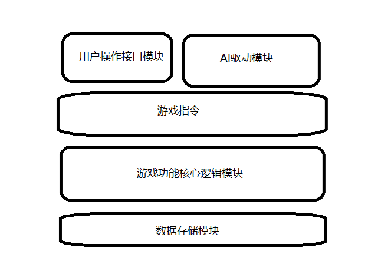

# **玩法说明**
1、本游戏是一个在线多人匹配游戏，最大人数为8人
2、游戏开始，每个玩家拥有100的HP，并获得一定的初始金币，金币随着回合数增加，并且每回合重置金币数为最大金币数（每两回合增加1）玩家的HP会随着回合数和敌方随从存活数量计算损失
3、游戏内设置商城，商城内卡池随等级随机，等级越高所购随从等级越高，每回合随机刷新卡池，可以用金币手动随机，每次消耗1金币
4、随从拥有攻击力，血量，效果，战吼，亡语属性，每个随从攻击时会对对方造成等于自身攻击力数值的伤害，同时自己扣除对方攻击力数值的血量，攻击过程为随机攻击；效果在战斗开始前生效，有攻击光环（增加全体攻击力）、生命值光环（增加全体生命值）、伤害免疫（免疫第一次攻击或者免疫致命攻击或者免疫一定量的攻击）、伤害增幅（造成攻击力*n倍的伤害）、召唤（召唤n张卡牌来协助自己作战）；战吼与亡语在战斗回合开始后生效，战吼有全体攻击，全体增伤，群体伤害免疫，单体伤害免疫等，亡语在随从阵亡时生效，随机生成效果；
# **内容设计**

- ## 模块划分及功能说明
  - ### _用户操作接口模块_：用户能够在命令行进行输入，程序能够解析用户输入并调用相应操作并执行，并能够通过命令行输出以文字形式实现结果展示
  - ### _功能核心逻辑模块_
  - ### _数据存储模块_
  - ### _AI 驱动模块_
  - ### _功能扩展模块_
- ## 模块间层次图
  
- ## 模块概要设计
- ## 模块详细设计
